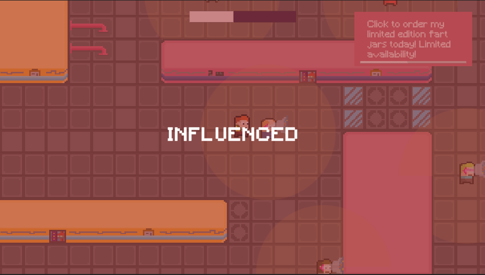
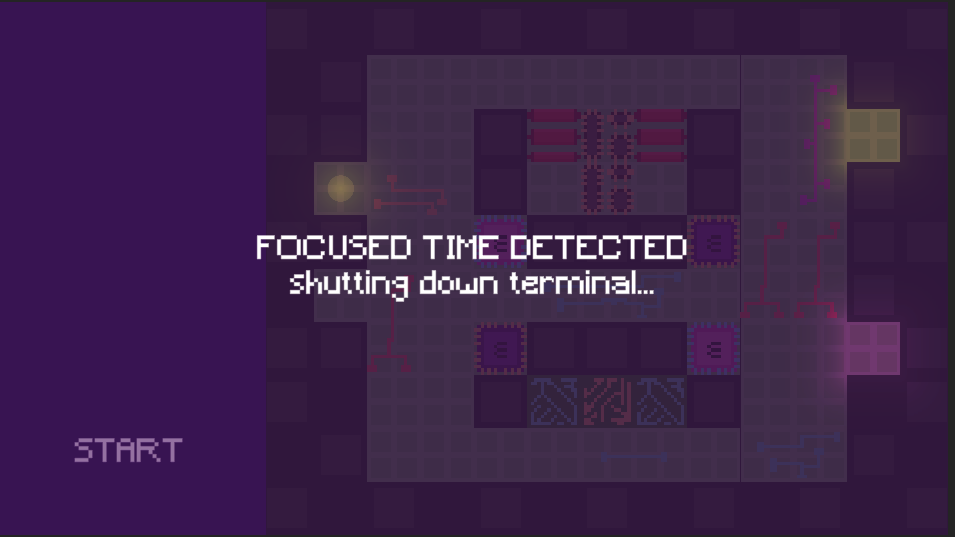
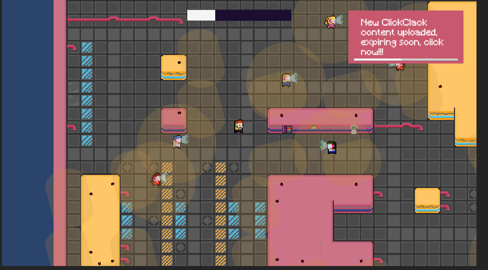

### Aberration

This is my LD51 (theme "every 10 seconds") compo submission, click [here](https://ldjam.com/events/ludum-dare/51/aberration) to play it in browser.

Every 10 seconds everyone receives a new notification directly into their neural interfaces. Everybody is compelled to consume it. You, however, seem to be resistant. An aberration.

Guided by a mysterious figure, you sneak through a world of content addicts and influencers, avoid the authorities, and try and fight the central computer terminals that run all compelled content recommendations.

#### Gameplay

Don’t spend too much time around content consuming people or you will be influenced yourself.

Hacking mini game where you attempt to cross the controlling algorithms’s wires.

The system is always watching and aberrant behaviour will not be tolerated. Avoid the prying eyes.

#### Tools

- Game engine: Unity
- Pixel art: Pixaki
- Various art editing: Affinity Designer
- Audio effects: Bfxr
- Music: GarageBand (whirly piano)

Many firsts for me with this one (first unity game, first tilemap, first original song, etc). The project source is a big bowl of spaghetti but I'm fairly pleased with the overall result. I wish I had more time to do animations, improve sound effects, and polish a few things here and there but i'm quite hapy with what i got done over 48 hours given where I started out skill wise.
